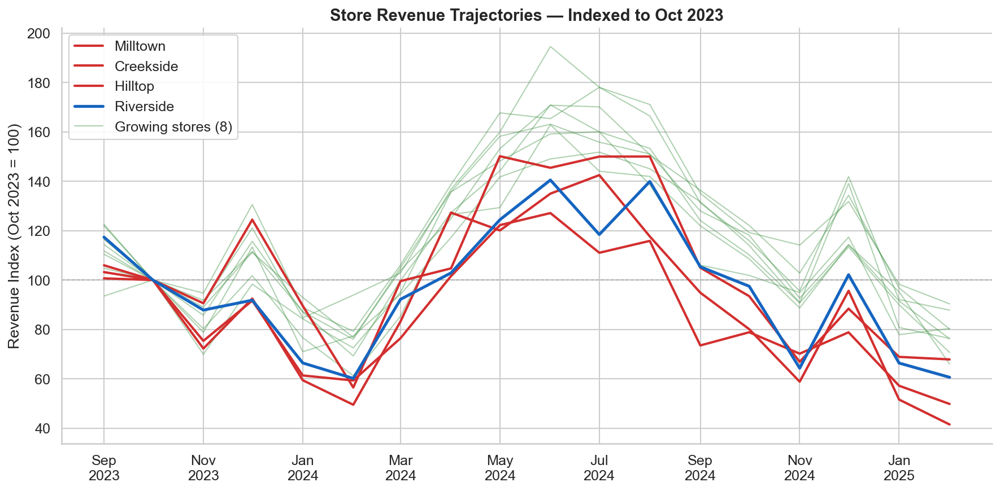
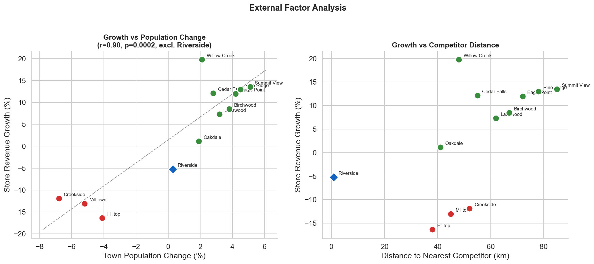

# GreenTrail Outdoor Co. — Store Performance Insights

**Prepared for:** Sarah Chen, CEO
**Date:** February 2025
**Analyst:** GreenTrail Analytics Engagement

---

## Page 1: The Situation

**Four of twelve stores are declining — and the trend is accelerating.**

GreenTrail Outdoor Co. operates 12 stores across regional towns generating approximately **$7.6M in annual revenue**. Over the past 18 months, a clear performance divergence has emerged:

- **8 stores** are growing at 3–14% — in line with healthy regional outdoor retail
- **4 stores** are declining at 5–16% — representing **$2.6M** (23% of total chain revenue over 18 months)

The decline is not uniform. Three stores (Milltown, Creekside, Hilltop) show broad-based revenue erosion across all product categories. One store (Riverside) shows a sharply different pattern — category-specific losses that began abruptly in late 2023.

**This is not a chain-wide problem.** The majority of GreenTrail stores are performing well. But without intervention, the four declining stores risk pulling overall profitability down within 12 months.

---

## Page 2: What We Found

Our analysis identified **two distinct drivers** behind the four declining stores.

### Driver 1: Demographic Headwinds (Milltown, Creekside, Hilltop)

These three stores are located in towns losing **4–7% of their population** since 2023. The revenue decline tracks population decline almost exactly:

| Store | Town Pop. Change | Revenue Change |
|-------|:----------------:|:--------------:|
| Milltown | –5.2% | –13.1% |
| Creekside | –6.8% | –11.9% |
| Hilltop | –4.1% | –16.4% |

Across all 12 stores (excluding Riverside), **population change explains 81% of the variance in revenue growth** (Pearson r = 0.90, p < 0.001). These declines are **structural and market-driven**, not operational — every product category is affected proportionally.

**So what:** These stores are not underperforming. They are tracking their local market. Operational fixes alone will not reverse a shrinking customer base.

### Driver 2: Competitive Displacement (Riverside)

Riverside tells a different story. The town's population is **stable (+0.3%)**, yet the store lost significant revenue starting October 2023 — exactly when **Kathmandu opened a store 800m away**.

The impact is surgically specific to **categories where Kathmandu competes directly**:

| Category | Revenue Change | Explanation |
|----------|:--------------:|-------------|
| Camping | –39% | Direct competitor overlap |
| Hiking | –36% | Direct competitor overlap |
| Fishing | +9% | No competitor overlap |
| Hunting | +30% | No competitor overlap |

Fishing and hunting revenue actually grew — Kathmandu does not carry these ranges. This confirms **competitive displacement, not demand destruction**.

---

## Page 3: Recommendations

### 1. Population-Declining Stores: Manage for Profitability, Not Growth

Milltown, Creekside, and Hilltop face structural decline. Recommended actions:

- **Consolidate to high-performing categories** — reduce SKU count in underperforming ranges
- **Right-size floor space** — consider subletting unused area or shifting to seasonal operation
- **Implement cost controls** — staffing levels should match declining foot traffic
- **Expected outcome:** Margin improvement of 2–4 pts even as revenue declines

### 2. Riverside: Double Down on What Kathmandu Can't Offer

Riverside's camping and hiking revenue is unlikely to return — Kathmandu has brand advantage and proximity. Instead:

- **Exit or significantly reduce** camping and hiking inventory (cede to Kathmandu)
- **Expand fishing and hunting** — GreenTrail has a local monopoly. Add dedicated space, expert staff, events (guided fishing trips, hunting workshops), loyalty program
- **Revenue recovery potential:** Estimated **$180K recoverable** of the ~$290K annual decline through fishing/hunting expansion and targeted marketing

### 3. Chain-Wide: Build a Monthly Performance Scorecard

GreenTrail had **no existing analytics** before this engagement. A monthly scorecard tracking store revenue, category mix, customer count, and basket size would have surfaced these trends 6 months earlier.

- **Quick win:** We can build an automated monthly store performance report as a follow-on engagement
- **Leading indicators:** Customer count decline precedes revenue decline by 2–3 months — this is the metric to watch

### Bottom Line

| | Revenue at Risk | Recoverable | Action |
|---|---:|---:|---|
| Population-declining stores (3) | ~$75K/yr | Limited | Manage for margin |
| Riverside | ~$290K/yr | ~$180K (62%) | Category rebalancing |
| **Total** | **~$365K/yr** | **~$180K** | |

Of the $365K in annual revenue decline, approximately **$180K (49%) is recoverable** through the Riverside category rebalancing strategy. The remaining decline in population-shrinking towns is structural and should be managed through cost optimization rather than revenue recovery.

---

*Supporting analysis, methodology, and statistical tests available in the full analytical workbook.*
